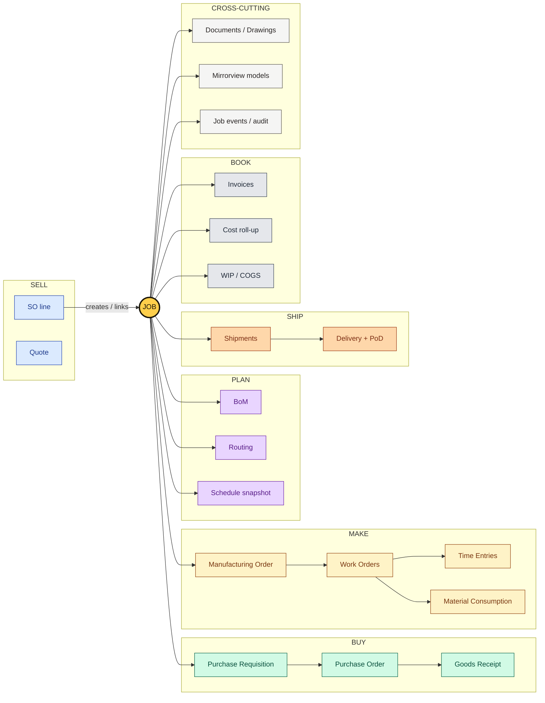
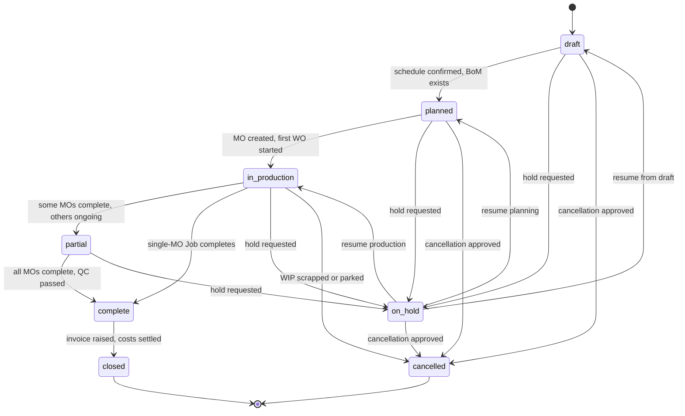
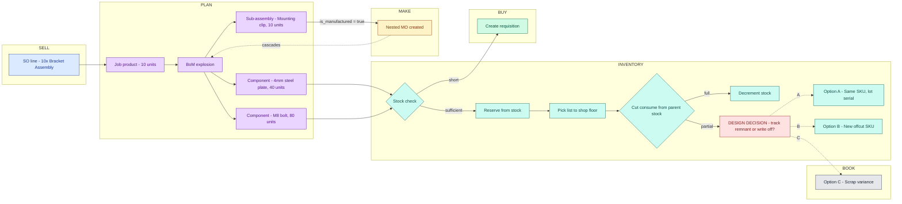
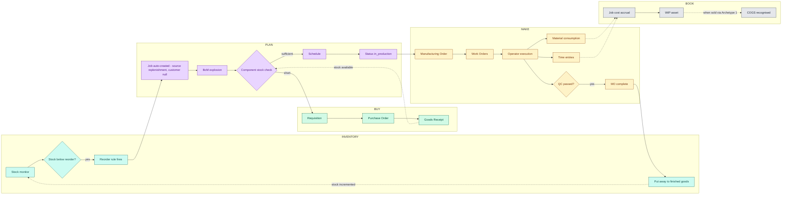
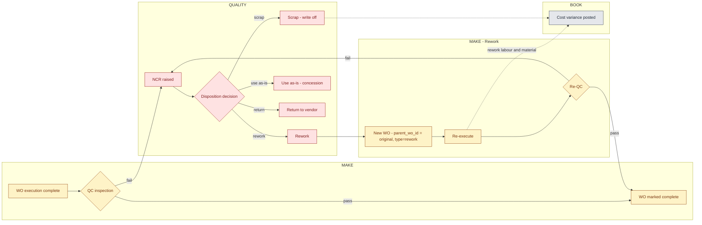
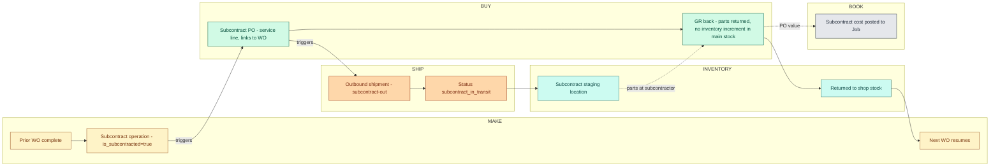

# MirrorWorks - Workflow Reference

Source-of-truth swimlane and spine diagrams covering the core order workflows in Smart FactoryOS. Lives at `docs/architecture/workflows.md` in the `Mirrorworksux` repo so Cursor and Claude Code can reference it during implementation and review.

Mermaid is the canonical source. FigJam renders are the visual artefact for stakeholder review.

## Module colour key

- Sell - light blue (`#DBEAFE`)
- Plan - light purple (`#E9D5FF`)
- Buy - light green (`#D1FAE5`)
- Make - light yellow / MW brand tint (`#FEF3C7`)
- Ship - light orange (`#FED7AA`)
- Book - light grey (`#E5E7EB`)
- Inventory - light teal (`#CCFBF1`) - cross-cutting, not yet a formal module in the specs
- Quality - light red (`#FEE2E2`) - NCRs, dispositions, decisions requiring product spec
- Cross-cutting - light stone (`#F5F5F4`) - Mirrorview, Documents, Job events
- Job spine accent - MW Yellow (`#FFCF4B`) - used only on the Job hub in Diagram 0

Column order convention for swimlanes: Sell -> Plan -> Buy -> Make -> Ship -> Book (chosen to minimise crossing arrows).

---

## Diagram 0 - Job Lifecycle (the spine)

The Job is the through-line of every workflow in MirrorWorks. Other ERPs treat the Job as a Production-module artefact and bolt the other modules around it. MirrorWorks makes the Job the spine that links Sell -> Plan -> Buy -> Make -> Ship -> Book. This needs to be visible in the spec, enforced in the schema, and surfaced in the UI.

### 0a. Job hub-and-spoke

The Job sits at the centre. Every operational entity references it via `job_id` FK. Master data (customers, products, suppliers, BoM templates, reorder rules, stock locations) is the only exception.

### 0b. Job state machine

State transition guards (what must be true to move from -> to):

- `draft -> planned`: schedule confirmed, BoM exists, material status is `available` or `ordered`
- `planned -> in_production`: at least one MO created with at least one WO started
- `in_production -> partial`: at least one MO complete and at least one MO incomplete
- `partial -> complete`: all MOs complete, QC passed, no open NCRs
- `in_production -> complete`: skip `partial` when only one MO exists
- `complete -> closed`: invoice raised, all costs settled, no open variances
- Any state -> `on_hold`: manual hold reason captured; resumes to the prior state
- Any state -> `cancelled`: cancellation reason captured; WIP scrapped or parked

Every transition writes a row to `job_events` (append-only) and triggers downstream subscribers via Convex reactive queries.

### Spine design contract

These rules apply to every diagram in this document and every commit that touches business logic:

- **Schema rule.** Every domain row has `job_id` as a non-optional FK, except: customers, products, suppliers, BoM templates, reorder rules, stock locations (masters, not job-scoped). If a row legitimately doesn't belong to a Job, document the reason in the schema comment.
- **Cost rule.** All cost flows debit and credit to the Job. `jobs.planned_cost`, `jobs.actual_cost`, `jobs.invoiced_value` are derived (single aggregation query over `time_entries`, `material_consumption`, `purchase_order_lines`, `bills`, and `manual_cost_adjustments`) but always available on the Job row for hot-path UI without joins. One source of truth for margin.
- **Document rule.** All operational documents (drawings, MTRs, photos, PoDs, ITRs) attach to the Job via a polymorphic `documents` table with `owner_type` / `owner_id`. This mirrors the proven pattern in `mirrorviewModels`.
- **Event rule.** All state transitions emit a `job_events` row. Other modules subscribe rather than poll. Convex reactive queries make this almost free.
- **UI rule.** Every list screen accepts a `jobId` filter and renders a Job-context banner when filtered. Every detail screen has a "View Job" pivot accessible from the header. Sales rep, planner, operator, dispatcher, and accounts can all reach the Job from their lane.
- **Lifecycle rule.** The Job state machine (0b above) is the only place that owns Job status. Other modules read it but never mutate it. Transitions go through a single `jobs.transition(jobId, toState)` mutation that checks gates and emits events.

This is what other ERPs get wrong. Make it un-bypassable.

---

## 1. MTO — Make-to-Order

The default workflow for any manufactured product on a confirmed sales order. Covers ~60-70% of typical fab shop revenue. Presented at two zoom levels: a **lifecycle view** (entity progression from quote to invoice) and a **material flow detail** (what happens inside Plan and Inventory during production).

### 1a. Lifecycle view

```mermaid
flowchart LR
    subgraph Sell["SELL"]
      direction TB
      OPP["Opportunity"]
      QUO["Quote"]
      SO["Sales Order confirmed"]
      OPP --> QUO
      QUO -->|"accepted"| SO
    end

    subgraph Plan["PLAN"]
      direction TB
      JOB["Job created from SO line"]
      BOM{"BoM exists?"}
      MRP["MRP - check stock vs required"]
      SCHED["Schedule operations"]
      INPROD["Status in_production"]
      JOB --> BOM
      BOM -->|"yes"| MRP
      MRP --> SCHED
      SCHED --> INPROD
    end

    subgraph Buy["BUY"]
      direction TB
      REQ["Purchase Requisition"]
      PO["Purchase Order"]
      GR["Goods Receipt"]
      VB["Vendor Bill three-way match"]
      REQ --> PO
      PO --> GR
      GR --> VB
    end

    subgraph Make["MAKE"]
      direction TB
      MO["Manufacturing Order"]
      WO["Work Orders per operation"]
      EXEC["Operator execution"]
      MATCONS["Material consumption logged"]
      TIME["Time entries logged"]
      QC{"QC passed?"}
      MODONE["MO complete"]
      MO --> WO
      WO --> EXEC
      EXEC --> MATCONS
      EXEC --> TIME
      EXEC --> QC
      QC -->|"yes"| MODONE
    end

    subgraph Ship["SHIP"]
      direction TB
      DISP["Dispatch record"]
      DEL["Delivery and PoD"]
      DISP --> DEL
    end

    subgraph Book["BOOK"]
      direction TB
      JC["Job cost accrual"]
      INV["Invoice generated"]
      JC --> INV
    end

    SO -->|"per line"| JOB
    MRP -->|"shortage"| REQ
    INPROD -->|"creates"| MO
    GR -.->|"stock available"| MATCONS
    MODONE --> DISP
    DEL -->|"triggers"| INV
    MATCONS -.->|"cost"| JC
    TIME -.->|"cost"| JC
    VB -.->|"PO cost"| JC

    classDef sell fill:#DBEAFE,stroke:#1E40AF,color:#1E3A8A
    classDef plan fill:#E9D5FF,stroke:#6B21A8,color:#581C87
    classDef make fill:#FEF3C7,stroke:#92400E,color:#78350F
    classDef buy fill:#D1FAE5,stroke:#065F46,color:#064E3B
    classDef ship fill:#FED7AA,stroke:#9A3412,color:#7C2D12
    classDef book fill:#E5E7EB,stroke:#374151,color:#1F2937

    class OPP,QUO,SO sell
    class JOB,BOM,MRP,SCHED,INPROD plan
    class REQ,PO,GR,VB buy
    class MO,WO,EXEC,MATCONS,TIME,QC,MODONE make
    class DISP,DEL ship
    class JC,INV book
```

### 1b. Material flow detail

Zoom-in on the Plan and Inventory steps inside §1a — what actually happens between `MRP` and `MO complete` for any non-trivial BoM. The remnant treatment decision is highlighted in red because it requires a product spec decision before launch.

### 1c. Remnant treatment options (open spec decision)

- Option A - Same SKU, lot or serial with remnant attribute. Closer to how a fabricator thinks ("we've got 4m left on that bar"). Harder to model in data.
- Option B - Cut creates a new offcut SKU, original fully consumed. Cleaner data. Operators dislike SKU proliferation.
- Option C - Scrap variance, no remnant tracking. Simplest. Loses real material visibility.

Recommendation: ship MVP with Option C, plan Option A for Phase 2 once the lot/serial infrastructure is in place.

### 1d. Key handoff validation gates

- Sales Order -> Job: SO status = `confirmed`, product status = `active`, `is_manufactured = true`, BoM exists
- Plan -> Make: all products have routing (>= 1 operation), all operations have work centre, planned dates set, material status = `available` or `ordered`
- Make -> Ship: all WOs complete, QC passed, no open NCRs
- Ship -> Book: delivery confirmed, invoicing policy met (per Sell settings)

---

## 2. Stock Sale (Archetype 1)

Stocked / catalogue items sold directly from inventory. Skips Plan and Make entirely. Per-line routing decision happens on SO confirmation - a single SO can mix stocked items (this flow) with manufactured items (main MTO flow).

```mermaid
flowchart LR
    subgraph Sell["SELL"]
      direction TB
      SO["Sales Order created"]
      RDETECT{"is_manufactured?"}
      RES["Reserve stock against SO line"]
      MTO["Route to Plan - main MTO"]
      SO --> RDETECT
      RDETECT -->|"false stocked"| RES
      RDETECT -->|"true"| MTO
    end

    subgraph Inventory["INVENTORY"]
      direction TB
      STK{"Stock available?"}
      ALLOC["Allocate to SO"]
      ALLOCP["Allocate partial qty"]
      BACK["Backorder"]
      STK -->|"full qty"| ALLOC
      STK -->|"partial"| ALLOCP
      STK -->|"none"| BACK
    end

    subgraph Buy["BUY"]
      direction TB
      REQ["Create requisition"]
      PO["Purchase Order"]
      GR["Goods Receipt"]
      REQ --> PO
      PO --> GR
    end

    subgraph Ship["SHIP"]
      direction TB
      PICK["Pick list"]
      PACK["Pack"]
      DISP["Dispatch"]
      DEL["Delivery and PoD"]
      PICK --> PACK
      PACK --> DISP
      DISP --> DEL
    end

    subgraph Book["BOOK"]
      direction TB
      INV["Invoice generated"]
      XERO["Xero sync"]
      INV --> XERO
    end

    RES --> STK
    BACK -.->|"auto-PO or wait"| REQ
    GR -.->|"stock arrives"| STK
    ALLOC --> PICK
    ALLOCP --> PICK
    DEL --> INV

    classDef sell fill:#DBEAFE,stroke:#1E40AF,color:#1E3A8A
    classDef buy fill:#D1FAE5,stroke:#065F46,color:#064E3B
    classDef ship fill:#FED7AA,stroke:#9A3412,color:#7C2D12
    classDef book fill:#E5E7EB,stroke:#374151,color:#1F2937
    classDef inv fill:#CCFBF1,stroke:#115E59,color:#134E4A

    class SO,RDETECT,RES,MTO sell
    class STK,ALLOC,ALLOCP,BACK inv
    class REQ,PO,GR buy
    class PICK,PACK,DISP,DEL ship
    class INV,XERO book
```

### Spec gaps to address

- Per-line routing detection on SO confirmation (Sell)
- Backorder vs auto-requisition behaviour as a per-product setting (`reorder_rules.shortage_behaviour`)
- Partial fulfilment handling on Ship (multi-shipment SO)

---

## 3. Make-to-Stock Replenishment (Archetype 3)

Reverse trigger: inventory reorder rule fires and creates a Job with no customer. Output goes to finished goods stock rather than dispatch. Costs accrue to WIP until eventually consumed by a future SO (via Archetype 1).

### Spec gaps to address

- `plan_jobs.customer_id` needs to be nullable, or introduce a "Stock" pseudo-customer
- `plan_jobs.source` field needed with values: `sales_order`, `replenishment`, `manual`
- Put-away as an inventory operation distinct from goods receipt (Buy spec covers GR -> inventory increment; Make -> inventory needs equivalent handling)
- WIP -> Finished Goods -> COGS transition in Book module (avoid double-counting at sale)

---

## 4. Engineer-to-Order (ETO)

The two-job pattern. An engineering Job produces the BoM, drawings, and routing for a custom product. Once the engineering Job is complete and the BoM is published, a production Job picks up via the standard MTO flow. Common for custom enclosures, structural one-offs, anything that needs design before manufacture.

```mermaid
flowchart LR
    subgraph Sell["SELL"]
      direction TB
      SO["SO confirmed - ETO product"]
    end

    subgraph PlanE["PLAN - Engineering"]
      direction TB
      EJOB["Engineering Job - is_engineering=true"]
      ETASK["Engineering tasks - design, drawing, BoM authoring"]
      EREV["Engineering review and approval"]
      EBOM["BoM and CAD published"]
      EJOB --> ETASK
      ETASK --> EREV
      EREV --> EBOM
    end

    subgraph PlanP["PLAN - Production"]
      direction TB
      PJOB["Production Job - parent_job_id = engineering job"]
      MRP["MRP from new BoM"]
      SCHED["Schedule operations"]
      INPROD["Status in_production"]
      PJOB --> MRP
      MRP --> SCHED
      SCHED --> INPROD
    end

    subgraph Make["MAKE"]
      direction TB
      MO["MO + WOs"]
      EXEC["Operator execution"]
      MODONE["MO complete"]
      MO --> EXEC
      EXEC --> MODONE
    end

    subgraph Ship["SHIP"]
      direction TB
      DISP["Dispatch + Delivery"]
    end

    subgraph Book["BOOK"]
      direction TB
      ECOST["Engineering cost - bill as hours OR roll into product cost"]
      INV["Invoice"]
    end

    SO --> EJOB
    EBOM -->|"unlocks production"| PJOB
    INPROD --> MO
    MODONE --> DISP
    DISP --> INV
    ETASK -.->|"engineering time"| ECOST

    classDef sell fill:#DBEAFE,stroke:#1E40AF,color:#1E3A8A
    classDef plan fill:#E9D5FF,stroke:#6B21A8,color:#581C87
    classDef make fill:#FEF3C7,stroke:#92400E,color:#78350F
    classDef ship fill:#FED7AA,stroke:#9A3412,color:#7C2D12
    classDef book fill:#E5E7EB,stroke:#374151,color:#1F2937

    class SO sell
    class EJOB,ETASK,EREV,EBOM,PJOB,MRP,SCHED,INPROD plan
    class MO,EXEC,MODONE make
    class DISP ship
    class ECOST,INV book
```

### Validation gates

- SO line -> Engineering Job: product flagged `engineering_required = true`
- Engineering Job -> BoM publish: drawings approved, BoM validated, routing assigned
- BoM publish -> Production Job: parent engineering job in state `complete`, BoM and routing both linked
- Standard MTO gates apply from Production Job onward

### Gaps in this archetype

- `plan_jobs.is_engineering` flag and `plan_jobs.parent_job_id` field (parent_job_id also needed for VO)
- Engineering work mode in Make - tasks rather than MOs/WOs (decision: separate entity or reuse Job tasks?)
- Engineering cost handling policy (per-customer setting: bill as hours, roll into product, or write off)
- Product flag `engineering_required` to trigger the two-job pattern

---

## 5. Variation Order (VO)

Parent SO is already in production when the customer requests a change. Scope, quantity, or spec changes that need impact assessment and customer approval before re-firing parts of the workflow. The diagram shows what gets re-fired: MRP yes, schedule yes for incomplete WOs, completed WOs no.

```mermaid
flowchart LR
    subgraph Sell["SELL"]
      direction TB
      PARENTSO["Parent SO in_production"]
      VOREQ["Variation request received"]
      VOIMPACT["Impact analysis - cost delta, schedule delta"]
      VOAPPR["Customer approval"]
      CHILDSO["Child SO - is_variation_of = parent"]
      PARENTSO --> VOREQ
      VOREQ --> VOIMPACT
      VOIMPACT --> VOAPPR
      VOAPPR --> CHILDSO
    end

    subgraph Plan["PLAN"]
      direction TB
      JOBAMEND["Amend parent Job - lines, qty"]
      BOMAMEND["Amend BoM if needed"]
      MRPREFIRE["Re-run MRP on delta"]
      SCHEDADJ["Adjust schedule - incomplete WOs only"]
      JOBAMEND --> BOMAMEND
      BOMAMEND --> MRPREFIRE
      MRPREFIRE --> SCHEDADJ
    end

    subgraph Make["MAKE"]
      direction TB
      WODELTA["Generate delta WOs"]
      RESUME["Resume execution"]
      WODELTA --> RESUME
    end

    subgraph Book["BOOK"]
      direction TB
      RECOST["Recompute Job cost roll-up"]
      INVDELTA["Invoice delta - line on next invoice or separate VO invoice"]
      RECOST --> INVDELTA
    end

    CHILDSO --> JOBAMEND
    SCHEDADJ --> WODELTA
    RESUME -.->|"new costs"| RECOST

    classDef sell fill:#DBEAFE,stroke:#1E40AF,color:#1E3A8A
    classDef plan fill:#E9D5FF,stroke:#6B21A8,color:#581C87
    classDef make fill:#FEF3C7,stroke:#92400E,color:#78350F
    classDef book fill:#E5E7EB,stroke:#374151,color:#1F2937

    class PARENTSO,VOREQ,VOIMPACT,VOAPPR,CHILDSO sell
    class JOBAMEND,BOMAMEND,MRPREFIRE,SCHEDADJ plan
    class WODELTA,RESUME make
    class RECOST,INVDELTA book
```

### Validation gates

- VO raise: parent SO state in `confirmed` or `in_production`, not `complete` or `closed`
- Impact -> approval: cost and schedule deltas computed, customer notification sent
- Approval -> amend: customer signed acknowledgement captured
- Amend Job: completed WOs are immutable; only incomplete WOs and unstarted MOs can be modified
- Re-cost: triggers on amend, posts cost variance to Job

### Gaps in this archetype

- `sales_orders.is_variation_of` FK
- Delta MRP and delta scheduling logic (not full re-runs)
- WO immutability rules: which states block amendment
- Customer approval capture (signature, timestamp, document)
- VO invoicing pattern (delta line vs separate VO invoice - tenant setting)

---

## 6. Rework Loop

WO fails QC. NCR raised with disposition: rework, scrap, use-as-is, or return-to-vendor. If rework, a new WO is created with `parent_wo_id` linking to the original. Closes the QC failure gap in §1.

### Validation gates

- QC fail -> NCR: inspector identity captured, failure reason from controlled vocabulary
- NCR -> disposition: requires authorised approver per tenant role config
- Rework -> new WO: original WO frozen, parent_wo_id set, new WO inherits routing
- Re-QC: identical gate to original QC
- RTV: triggers vendor return shipment (cross-cuts to Buy)

### Gaps in this archetype

- NCR entity with state machine (open -> dispositioned -> closed)
- `qc_outcomes` entity capturing pass/fail per WO with inspector and timestamp
- Disposition enum: `rework`, `scrap`, `use_as_is`, `return_to_vendor`
- `work_orders.parent_wo_id` FK
- `work_orders.type` enum: `production`, `rework`
- Variance posting account configuration in Book
- Concession workflow (use-as-is requires customer acceptance)

---

## 7. Subcontract

Routing operation flagged `is_subcontracted`. A mini-PO is raised to the subcontractor. Outbound shipment moves parts to a subcontract-in-transit location. Goods receipt back into a subcontract-staging or shop stock location. Next operation resumes. Touches Buy, Ship, and Inventory on a single WO chain.

### Validation gates

- Sub-op trigger: prior WO complete and QC passed
- PO raise: subcontractor selected, lead time committed
- Outbound shipment: parts physically packed and tracked
- GR back: parts returned, count verified, condition inspected
- Next WO resume: parts in shop stock or subcontract-staging location

### Gaps in this archetype

- `routing_operations.is_subcontracted` flag
- `purchase_orders.type` enum: `material`, `subcontract`, `service`
- Subcontract-specific stock locations (in-transit, at-subcontractor)
- Outbound shipment as a SHIP-module concept distinct from customer dispatch
- Cost posting: subcontract spend posted as labour-equivalent vs material (tenant setting)
- Subcontractor management (supplier records flagged `is_subcontractor=true`)

---

## 8. Spec gaps summary (cross-archetype)

Worth dropping these into the Plan, Make, Book, and Inventory specs as open items before April launch.

### Job spine (from Diagram 0)

- `jobs` table with `source`, nullable `customer_id`, `quantity`, `state`, `parent_job_id`, `is_engineering` flag, cost roll-up fields (`planned_cost`, `actual_cost`, `invoiced_value`)
- `job_events` append-only table for state transitions and module subscriptions
- `documents` polymorphic table (`owner_type` / `owner_id`) mirroring the proven `mirrorviewModels` pattern
- Single `jobs.transition()` mutation as the only path to mutate `jobs.state`

### Original three archetypes (§1-§3)

- Per-line routing detection on SO confirmation (Sell -> routes to dispatch or to Plan)
- Backorder vs auto-requisition behaviour as a per-product setting
- Put-away as an inventory operation distinct from goods receipt
- WIP -> Finished Goods -> COGS transition in Book
- Inventory module scope: currently spread between Sell (products table), Buy (goods receipts), and Make (consumption). May warrant its own module spec or formal inclusion in Make.
- Remnant treatment decision (Option A / B / C from §1c)
- Sub-assemblies: confirmed that nested MOs are needed; current Plan -> Make handoff spec doesn't explicitly support cascading MO creation

### ETO (§4)

- `plan_jobs.is_engineering` and `plan_jobs.parent_job_id` (parent_job_id reused by VO)
- Engineering work mode: tasks vs MOs/WOs
- Engineering cost handling policy
- `products.engineering_required` flag

### Variation Order (§5)

- `sales_orders.is_variation_of` FK
- Delta MRP and delta scheduling logic
- WO immutability rules during amendment
- Customer approval capture (signature, timestamp, document attachment)
- VO invoicing pattern (delta line vs separate invoice - tenant setting)

### Rework (§6)

- `ncrs` (Non-Conformance Records) entity with state machine
- `qc_outcomes` entity
- Disposition enum: `rework`, `scrap`, `use_as_is`, `return_to_vendor`
- `work_orders.parent_wo_id` FK and `work_orders.type` enum
- Variance posting accounts in Book

### Subcontract (§7)

- `routing_operations.is_subcontracted` flag
- `purchase_orders.type` enum
- Subcontract stock locations (`subcontract_in_transit`, `subcontract_staging`)
- Outbound shipment type in Ship
- `suppliers.is_subcontractor` flag

---

## 9. Review checklist for Claude Code

Use this list when reviewing the diagrams against the codebase.

### Spine-level

- Does the Convex schema have a `jobs` table with all the fields listed in §8?
- Is `jobs.transition()` the only path that mutates `jobs.state`?
- Does every domain table have a `job_id` FK (except documented masters)?
- Is there a `job_events` append-only table, written on every transition?
- Is there a polymorphic `documents` table following the `mirrorviewModels` pattern?
- Does every list screen accept a `jobId` filter? Does every detail screen have a "View Job" pivot?

### Per archetype

- Are the entities in each swimlane (SO, Quote, Job, MO, WO, NCR, etc.) actually modelled in the Convex schema?
- Do the validation gates exist as checks in the relevant service files (e.g. `src/lib/services/sales-orders.ts`)?
- Are the cross-module handoffs implemented as functions, or are they still hardcoded UI navigation?
- Are the spec gaps in §8 reflected as TODOs in the code?
- Is per-line routing logic present on SO confirmation, or does the current code assume all lines go to Plan?
- For §4-§7 archetypes: do the new fields (`is_engineering`, `parent_job_id`, `is_variation_of`, `parent_wo_id`, `is_subcontracted`) exist anywhere yet?
