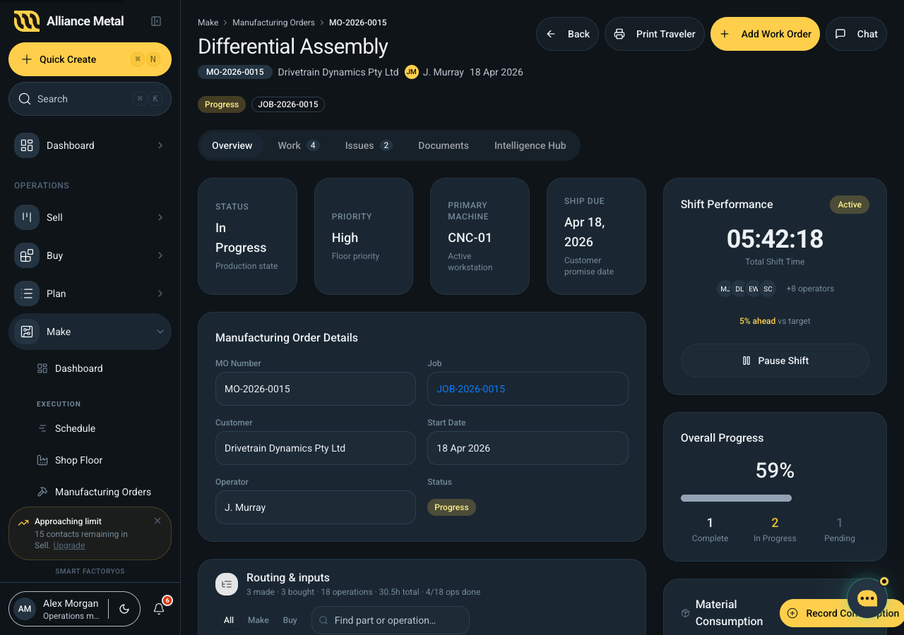

# Manufacturing Order Detail

## Summary
Manufacturing Order Detail screen. This is a dynamic detail route. Current implementation includes mock/seed data paths.

## Route
`/make/manufacturing-orders/:id`

## User Intent
Inspect one record deeply and complete context-specific follow-up actions.

## Primary Actions
- Search and filter records.
- Create or add records/items.
- Open related pages and record detail views.

## Key UI Sections
- Charts and trend cards.
- Form controls for editing/creation.
- Embedded AI/assistant insight panels.

## Data Shown
- Order headers, statuses, due dates, quantities, and values.
- Work-order/job execution data, machine context, and production statuses.
- Current page includes mock/seed data sources (inferred from code).

## States
- default
- error
- success
- populated

## BOM + routing view (2026-04-22)

The MO detail now renders the shared `<BomRoutingTree assembly={assembly} mode="make" />` — same tree Plan → Job detail → Production tab authors, but in read-only mode with live op status. The demo assembly comes from `@/components/plan/BomRoutingTree.data` (`getDifferentialAssembly()`).

See [BomRoutingTree dev doc](../plan/bom-routing-tree.md).

## Components Used
- `@/components/plan/BomRoutingTree` *(added 2026-04-22, mode="make")*
- `@/components/make/MaterialConsumption`
- `@/components/make/OperatorChat`
- `@/components/shared/ai/AIFeed`
- `@/components/shared/ai/AIInsightCard`
- `@/components/shared/data/ProgressBar`
- `@/components/shared/data/StatusBadge`
- `@/components/shared/icons/IconWell`
- `@/components/shared/layout/JobWorkspaceLayout`
- `@/components/ui/avatar` / `badge` / `button` / `card` / `input` / `label`

## Logic / Behaviour
- Local state drives search/filter and derived visible lists.
- Routing links and back navigation are handled in-component.
- Behavior is largely client-side React state and memoized derivations.

## Dependencies
- No explicit store/service/hook dependency imported in this component.

## Design / UX Notes
- Mock/seed records are present; edge-case realism may be limited.
- Placeholder/legacy text suggests unfinished UX in parts of this page.
- Action persistence paths are not fully visible in this component alone.

## Known Gaps / Questions
- Code includes explicit placeholder/legacy markers; some interactions are transitional.
- Page appears mock/seed-backed; production API integration path is unclear from this file alone.

## Related Files
- `apps/web/src/components/make/MakeManufacturingOrderDetail.tsx`
- `apps/web/src/components/shop-floor/WorkOrderFullScreen.tsx`
