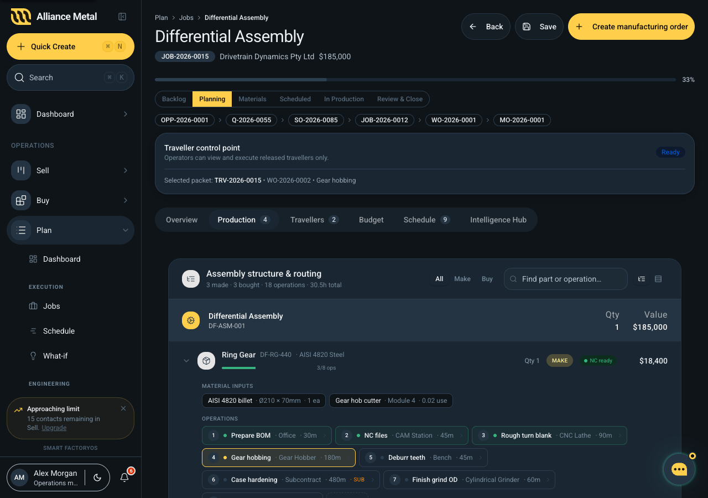

# BomRoutingTree (Plan + Make)

Integrated BOM + routing view. Added 2026-04-22 (commit `03733e06`). Inspired by Fulcrum Pro / Global Shop Solutions' "Routing BOM" screens.



## Files

| Path | Role |
|---|---|
| `apps/web/src/components/plan/BomRoutingTree.tsx` | Component. |
| `apps/web/src/components/plan/BomRoutingTree.types.ts` | `AssemblyNode`, `PartNode`, `OperationNode`, `MaterialInput`. |
| `apps/web/src/components/plan/BomRoutingTree.data.ts` | Sample `getDifferentialAssembly()` builder used by Plan Production and Make MO detail demos. |

## API

```ts
interface BomRoutingTreeProps {
  assembly: AssemblyNode;
  mode?: 'plan' | 'make';               // default 'plan'
  defaultExpandedPartIds?: string[];
  className?: string;
}
```

- `mode="plan"` — planner-editable surface (add/edit rows, toggle density).
- `mode="make"` — read-only, adds live op status dots.

## Node model

```ts
interface AssemblyNode {
  name: string;
  partNumber: string;
  qty: number;
  cost: number;
  parts: PartNode[];
}

interface PartNode {
  id: string;
  name: string;
  partNumber: string;
  kind: 'make' | 'buy';
  qty: number;
  uom: string;
  material?: string;
  cost: number;
  supplier?: string;
  ncReady?: boolean;
  inputs?: MaterialInput[];
  operations?: OperationNode[];
}

interface OperationNode {
  id: string;
  sequence: number;
  name: string;
  workCentre: string;
  operator?: string;
  minutes: number;
  status: 'done' | 'in_progress' | 'pending';
  instructionsFile?: string;
  subcontract?: boolean;
}
```

Every part shows its **material inputs** and the **sequence of operations** that produce it — no more tab-hopping between BOM and routing.

## Density toggle

`Density = 'tree' | 'table'` — tree renders a collapsible hierarchy, table flattens to a compact row view. Plan mode exposes both; Make mode inherits whatever density Plan saved.

## Status dot colours

| Status | Token |
|---|---|
| `done` | `--mw-green` |
| `in_progress` | `--mw-yellow-400` |
| `pending` | `--neutral-300` |

## Consumers

- `apps/web/src/components/plan/PlanProductionTab.tsx` — Plan-mode, editable. This commit collapsed the old three-tab layout (products/activities/instructions) into a single view built around this tree.
- `apps/web/src/components/make/MakeManufacturingOrderDetail.tsx` — Make-mode, read-only, inherits the same assembly definition.

Both consumers currently call `getDifferentialAssembly()` from the demo data file — when real jobs/MOs wire up, swap to a service call.

## Filters

- Kind filter: `all | make | buy`.
- Free-text search across part name, part number, material.

## Related files

- [3D viewers dev doc](../../shared/3d-viewers.md) — the Plan Production tab renders `GlbViewer` and `DrawingViewer` under this tree.
