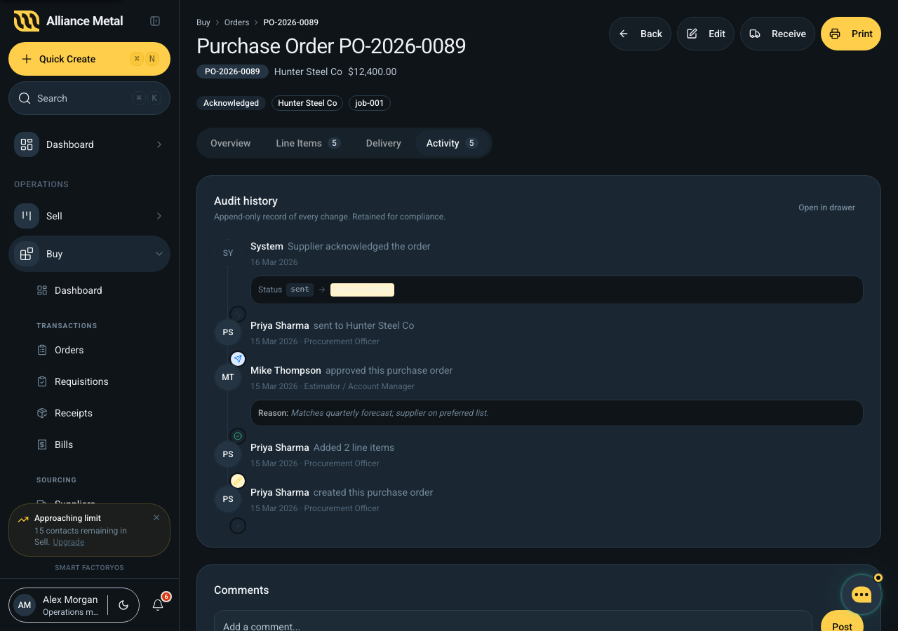

# Audit Timeline (shared)

Shared append-only history-of-changes surface. Introduced 2026-04-22 (commit `03733e06`).



## Files

| Path | Export | Role |
|---|---|---|
| `apps/web/src/services/auditService.ts` | `auditService`, types | Mock-backed event log; same interface will map to a single `audit_events` Supabase table. |
| `apps/web/src/components/shared/audit/AuditTimeline.tsx` | `<AuditTimeline>` | Renders events for an entity. `variant="mini"` (compact N-latest feed) or `variant="full"` (all events). |
| `apps/web/src/components/shared/audit/AuditTimelineSheet.tsx` | `<AuditTimelineSheet>` | Right-side drawer wrapper with filter pills (All / Changes / Approvals / Activity) and an Export button (toast stub). |

## Service API

```ts
auditService.list(entityType, entityId, { limit?, actions? }): AuditEvent[]
auditService.record(event): AuditEvent          // append + return with id/occurredAt
auditService.resolveActor(actorId, actorType): ResolvedActor
```

### Types

```ts
type AuditEntityType =
  | 'purchase_order' | 'purchase_requisition' | 'goods_receipt' | 'vendor_bill'
  | 'purchase_agreement' | 'quote' | 'sales_order' | 'invoice'
  | 'manufacturing_order' | 'delivery_order' | 'capa' | 'role_assignment';

type AuditAction =
  | 'created' | 'updated' | 'status_changed' | 'approved' | 'rejected'
  | 'submitted' | 'sent' | 'amended' | 'cancelled' | 'commented' | 'received';

interface FieldChange {
  path: string;        // e.g. "status" or "items[2].unitPrice"
  label?: string;
  before: unknown;
  after: unknown;
  format?: 'currency' | 'date' | 'text';
}

interface AuditEvent {
  id: string;
  occurredAt: string;
  actorId: string | null;    // null for system events
  actorType: 'user' | 'system' | 'api';
  entityType: AuditEntityType;
  entityId: string;
  action: AuditAction;
  description: string;
  fieldChanges?: FieldChange[];
  reason?: string;
  metadata?: Record<string, unknown>;
}
```

Actors resolve against the `employees` mock; unknown ids render as `?? / "Unknown user"`. System events show `SY / "System"`.

## Seed data

`STORE` in `auditService.ts` carries a handful of sample events for:
- `po-001` — richest sample: create → amend → approve → send → supplier-acknowledge (system event).
- `po-002` — partial receipt flow incl. a price change with a `FieldChange` row.
- `req-001` — create + submit.

Add to the mock by calling `auditService.record(...)` from any component handler.

## Wiring

Callers render both variants on a document detail page:

```tsx
<AuditTimeline entityType="purchase_order" entityId={order.id} variant="mini" limit={3} />
<AuditTimelineSheet
  entityType="purchase_order"
  entityId={order.id}
  entityLabel={order.poNumber}
  open={historyOpen}
  onOpenChange={setHistoryOpen}
/>
```

Current consumers:
- `apps/web/src/components/buy/BuyOrderDetail.tsx` — Overview shows mini (3-latest), Activity tab shows full, header drawer opens the Sheet.
- `apps/web/src/components/buy/BuyNewOrder.tsx` — Calls `auditService.record` in the "Save draft" and "Send to supplier" handlers to seed history on the newly-minted PO.

## Action → icon / tone mapping

Defined in `AuditTimeline.tsx::ACTION_META`. Each action maps to a Lucide icon, a foreground colour token, and a background tint — derived from `--mw-success`, `--mw-error`, `--mw-warning`, `--mw-blue`, or the neutral palette. Changing this mapping changes both variants.

## Relative-time rendering

`formatRelative()` uses fixed thresholds (minute / hour / day / week) and falls back to an `en-AU` long date after 5 weeks. Exact timestamps appear in the mini variant's tooltip via `formatExact()`.

## Known gaps

- `STORE` is in-memory and per-session. Refresh wipes `record()` additions. Real impl = Supabase insert + RLS.
- `list()` does not paginate; the Sheet relies on overflow scrolling rather than virtualisation.
- Export button is a toast stub — no CSV/PDF generation wired.
- `resolveActor` returns the employee name but does not surface their tenant role; the `role?` field is populated but not rendered in the feed.

## See also

- Spec reference in `/Users/mattquigley/.claude/plans/looking-at-the-buy-sparkling-lantern.md` (system design §3 data model).
- [Buy order-detail dev doc](../modules/buy/order-detail.md) — concrete caller.
- [Buy new-order dev doc](../modules/buy/new-order.md) — concrete `auditService.record` caller.
