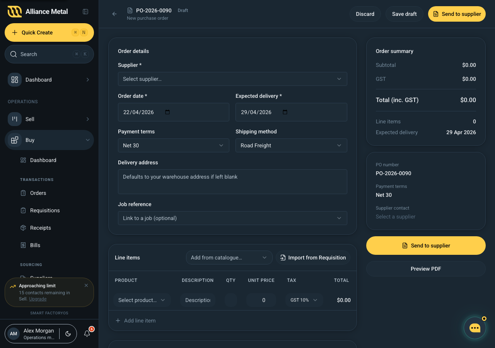

# Create a Purchase Order

## Summary
Full purchase-order builder. Lets a procurement user draft a PO, line-item by line-item, save it for later, or send it to the supplier.

## Route
`/buy/orders/new` — reached from the "Create PO" button on `/buy/orders`.

## User Intent
Write a new purchase order end-to-end in one screen: pick a supplier, add products, check totals, and send.

## Primary Actions
- Pick a supplier (auto-fills payment terms).
- Add one or more product lines, with inline editing of description, quantity, unit price, and tax treatment.
- Optionally link the PO to a job.
- Save as draft — keeps the PO for later and returns you to the orders list.
- Send to supplier — requires a supplier and at least one line; confirms before dispatching.

## Key UI Sections
- **Header form** — PO number (auto-generated), supplier, order date, expected delivery, payment terms, shipping method, optional job link.
- **Line items table** — borderless spreadsheet-style grid: product, description, qty, unit price, tax, total, remove.
- **Right-hand totals** — subtotal, tax, total. Sticks to the top of the viewport.
- **Agent bar** — context-aware recommendations.

## AI affordances
- **Supplier recommendation** — if you add product lines before picking a supplier, the agent suggests the highest-rated supplier for the mix.
- **Price anomaly warning** — if a unit price is more than 10% above the catalogue price, the row shows a warning chip and a summary card flags it in the agent bar.

## Data Shown
- Mocked suppliers, products, and jobs (no live ERP connection yet).
- PO number is auto-incremented from the existing 2026 sequence.

## States
- default (one empty line)
- with-lines
- anomaly-warning (at least one line 10%+ above catalogue)
- send-blocked (no supplier / no lines)
- sent (toast + redirect to orders list)

## Design / UX Notes
- Hitting **Send** records the creation and dispatch events in the order's history — you'll see them on the PO's Activity tab next time it loads.
- Saving as a draft also records a history event so the audit trail starts from draft creation, not send.
- The delivery-date default is seven days out; adjust if you know the supplier's lead time.
