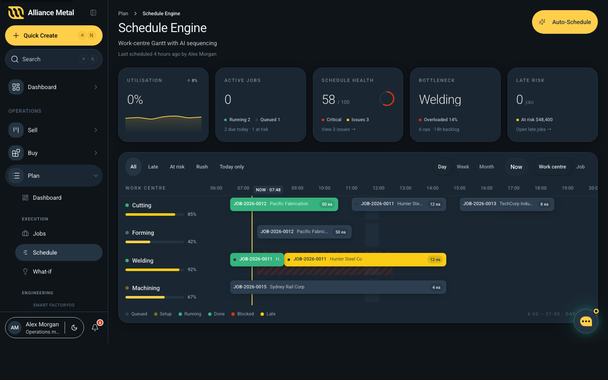

# Schedule Engine

## Summary

The Schedule Engine is the single screen where the planner sees every work centre's load for the day, drags jobs to reschedule, and asks the AI to re-sequence the floor when load gets out of balance.

It replaces the older Schedule and Activities pages — both routes redirect here.

## Route

`/plan/schedule-engine`

## User Intent

- See, at a glance, whether the floor is overloaded, balanced, or running late.
- Move a job to a different machine or time without leaving the page.
- Hand the schedule to the AI when manual sequencing is taking too long, then **review** what it proposes before any change reaches the floor.

## Page layout

Top to bottom:

1. **Header** — *Schedule Engine* + a single yellow **Auto-Schedule** button, top-right. The state line beneath the title says who scheduled it last and when ("Last scheduled 4 hours ago by Alex Morgan" or "Auto-scheduled 12 minutes ago by AI · 3 jobs moved").
2. **KPI strip** — five tiles, always in the same order:
    - **Utilisation** — average across all work centres, with a 7-day sparkline and last-week delta (▲/▼).
    - **Active jobs** — running + queued counts, plus a sub-line for jobs due today and jobs at risk.
    - **Schedule Health** — a single 0–100 score on a dark anchor card; click it to open the Issues sheet.
    - **Bottleneck** — the work centre that's currently overloaded, with backlog hours and queue depth.
    - **Late risk** — count of late-risk jobs and total AUD value at risk.
3. **Gantt** — work centres down the left, hours across the top (06:00 – 21:00 by default), today's `Now` line drawn vertically. Each block is one operation, coloured by status (queued / setup / running / done / blocked / late). Drag a block to reschedule it.
4. **Toolbar above the Gantt** — filters (`All` / `Late` / `At risk` / `Rush` / `Today only`), zoom (`Day` / `Week` / `Month`), group (`Work centre` / `Job`), and a **Now** button that scrolls the today-line back into view.

## Auto-Schedule flow

1. Click **Auto-Schedule** (top-right).
2. The confirmation dialog asks for:
    - **Optimisation priority** — Balanced / Throughput / On-time delivery / Setup minimisation.
    - **Time horizon** — Today / Next 24h / Next 7 days / Next 14 days.
    - **Lock options** — keep currently-running or rush jobs in place.
3. Click *Run auto-schedule*. A 5-step indicator appears:
    1. Reading work-centre capacity
    2. Analysing job dependencies
    3. Sequencing operations
    4. Balancing load
    5. Validating the proposed schedule
   The Gantt dims and shimmers while this runs (~4 seconds for the demo).
4. The Gantt swaps to the **proposed** view — moved blocks get a yellow border, an "AI proposal" pill appears, and a banner across the top summarises the change ("Moved 3 jobs, balanced load across 5 work centres, eliminated 2 late risks. Welding now 78% (was 92%)…").
5. **Apply** to commit the proposal and update the live schedule, or **Discard** to revert. Until you click one of these, **nothing changes on the floor**.

## Reviewing a proposal

While the proposed schedule is shown:

- Yellow borders mark every block that moved compared to the previous schedule.
- The hatched-stripe pattern over a block means it's a projected/forecast position rather than confirmed.
- The KPI tiles update to the proposed numbers — the delta vs current is implicit (the banner names the headline changes).
- Click any block to open the **Job detail** sheet on the right with the full move history and reasoning.

## Day vs Week vs Month

- **Day** is the only view where you can drag-reschedule. 15-minute precision.
- **Week** and **Month** swap the per-block Gantt for a colour-coded heatmap of work-centre load. Use these to spot overload patterns; switch back to Day to make the change.

## Filters and grouping

- **All / Late / At risk / Rush / Today only** filter the visible blocks but don't move them.
- **Work centre** (default) groups rows by machine. **Job** groups them by job number — useful for tracking one customer's order across machines.

## Data Shown

- Per-block: job number, customer, operation name, qty, due date, scheduled start/end, status, rush flag.
- Per-work-centre: name, type, capacity hours, current utilisation %, active job count, live machine status (running / setup / blocked / idle).
- Per-day: shift bands (default 07:00–17:00, 12:00 lunch), capacity heatmap.

## States

- **Default** — current schedule, no proposal pending.
- **Loading** — *"Loading schedule…"* below the title.
- **Confirming** — Auto-Schedule dialog is open.
- **Running** — 5-step AI indicator on screen, Gantt dims/shimmers.
- **Awaiting approval** — proposed schedule shown with banner, Auto-Schedule button changes to **Apply schedule** + a Discard button appears.
- **Applied** — toast: "Schedule applied. 14 operations resequenced." — view returns to default.

## Design / UX Notes

- Yellow stays the brand-spine accent for AI affordances only — block fill colours communicate **status**, not job identity.
- "Setup" and "late" both use yellow tones because they share the same caution semantic; running is green, blocked is red.
- The Auto-Schedule button glows (animated yellow halo) while the AI is thinking, then turns into a green check **Apply schedule** when a proposal is ready.
- The Now line is the same orange used elsewhere in the app for the current-time marker.

## Screenshot

