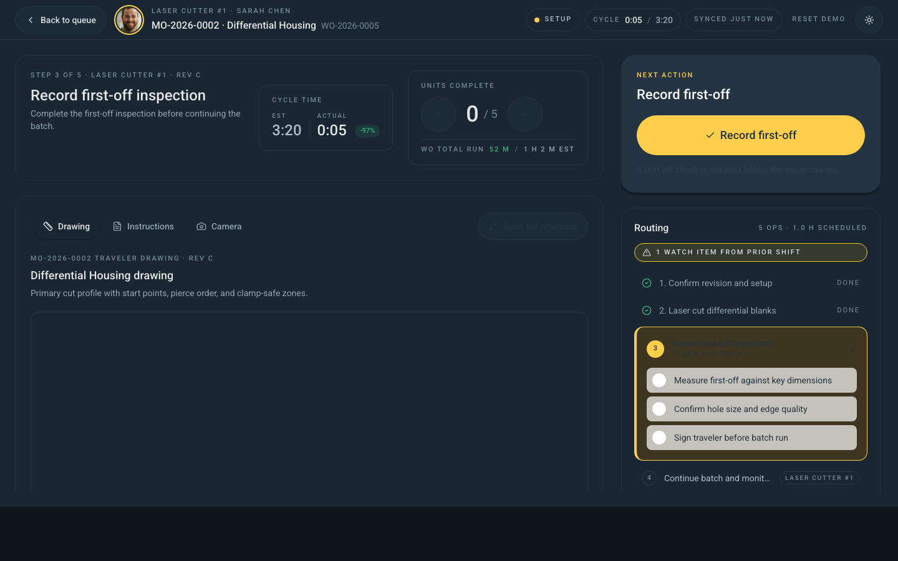

# Floor Run

## Summary

The kiosk screen an operator looks at while running a work order. As of the 2026-05-04 refactor, it's organised as a row of focused Andon-style cards — one per piece of operator information — with explicit dialogs for any one-off action (raise an NCR, print a label, close the WO).

## Route

`/floor/run/:workOrderId`

## User Intent

- Read the operation, drawing, and inspection rules at a glance from across the shop.
- Do exactly one thing per glance — one big yellow button at a time, no menus.
- Capture quality events (scrap, NCR, hold) without leaving the run screen.
- Close out a batch and print labels in three taps.

## Page layout

Top to bottom, left-to-right:

1. **Andon top bar** — back to queue · operator avatar · operation name + WO number · live status pill (Setup / Running / Blocked / Idle) · cycle-time clock (actual / target with variance %) · sync indicator · light/dark toggle. The whole bar gets a red top stripe and faintly red background when the WO is blocked.
2. **Operation header card** — left side. WO/MO/job number, customer, revision, station name, and a *Confirm revision* prompt if the drawing rev needs an explicit ack.
3. **Primary action card** — right side. The single yellow CTA for whatever the screen wants you to do next: *Record first-off* · *Pick all materials* · *Start running* · *Close WO*. Only one button here at any time.
4. **Materials pick list** — left side, below the header. Per-row check-boxes, scan-to-pick (barcode), bin location, picked timestamp. *Pick all* button at the top.
5. **Reference panel** — right side. Tabs: **Drawing** / **Instructions** / **Camera**. Default tab is whatever the work order specifies; switching tabs is remembered for the rest of the shift.
6. **Routing strip** — horizontal list of every operation step. Each step shows status (previous / current / next), reference type, and inspection gate. Click any step to open its detail drawer with checklist items.
7. **Quality actions row** — three icon buttons: **NCR** · **Hold** · **Scrap**. Each opens its own dialog.
8. **Time summary** — three small tiles: setup, run, first-off. Each shows estimate vs actual.
9. **Quick actions footer** — Print Label · Help · Sign out · Theme toggle.

## Dialogs (one focused task each)

- **Hold** — reason picker + note. Pauses the WO and turns the top bar red.
- **NCR (Non-Conformance Report)** — defect type, affected qty, optional measurement, notes.
- **Scrap** — reason from the canonical seven (Human error / Incorrect drawings / Issue with equipment / Material defect / Wrong material picked / Wrong program / Wrong tooling), qty, notes.
- **Print Label** — template selector, quantity, printer dropdown.
- **Close WO** — confirms final good-qty, optionally fires a label print, then returns to the queue.
- **Barcode** — manual fallback when the scanner can't read a part.

## Idle lock

If the operator hasn't touched the screen for **5 minutes**, a 30-second countdown appears warning that the screen is about to lock. After lock, the operator must re-authenticate via the kiosk session screen — the WO is held in place and resumes on re-login.

## Status colours

Same Andon palette used everywhere on the floor:

- **Running** → green
- **Setup** → yellow
- **Blocked** → red (with red top-bar stripe + red-tinted background)
- **Idle** → grey

When a quality issue is open, the top bar shows the issue chip; the rest of the screen stays usable so the operator can keep working alongside an ongoing NCR.

## Data Shown

- Work order header: WO/MO/job numbers, product, customer, revision (with rev-ack prompt if required), station, machine.
- Live: cycle time vs target with %-variance, elapsed run time, sync state, queued offline actions count.
- Routing: every step with status, inspection gates (`first_off` / `in_process` / `final`), per-step checklist.
- Quantities: good qty, scrap qty, target qty.
- Inspection: first-off due / in-process due / final due, frequency label, last-recorded label.
- Picking: per-row qty, unit, bin, picked status & timestamp.
- Time: setup/run/first-off — estimate vs actual minutes.

## States

- **Awaiting first-off** — first-off inspection blocks the *Start running* CTA.
- **Pick required** — pick list incomplete; *Pick all* is the primary CTA.
- **Running** — green status pill, cycle clock active.
- **On hold** — red top bar stripe; *Resume* CTA replaces the running CTA.
- **Failed inspection** — *Raise NCR* becomes the primary CTA.
- **Complete** — close-out confirmation, label-print summary.
- **Locked** — 30 s countdown then re-auth prompt.

## Design / UX Notes

- Every operator action queues offline — even when the connection drops, the kiosk keeps recording picks, scrap, NCRs, etc. The sync indicator in the top bar shows when the queue is draining.
- Yellow text never goes on a yellow surface — yellow is always paired with the dark mirage text colour, per the brand-spine rule.
- The reference tab choice is sticky per WO — switching to *Camera* on one job doesn't change the default for the next.
- Light vs dark theme is one click in the top bar; the kiosk remembers.

## Screenshot

